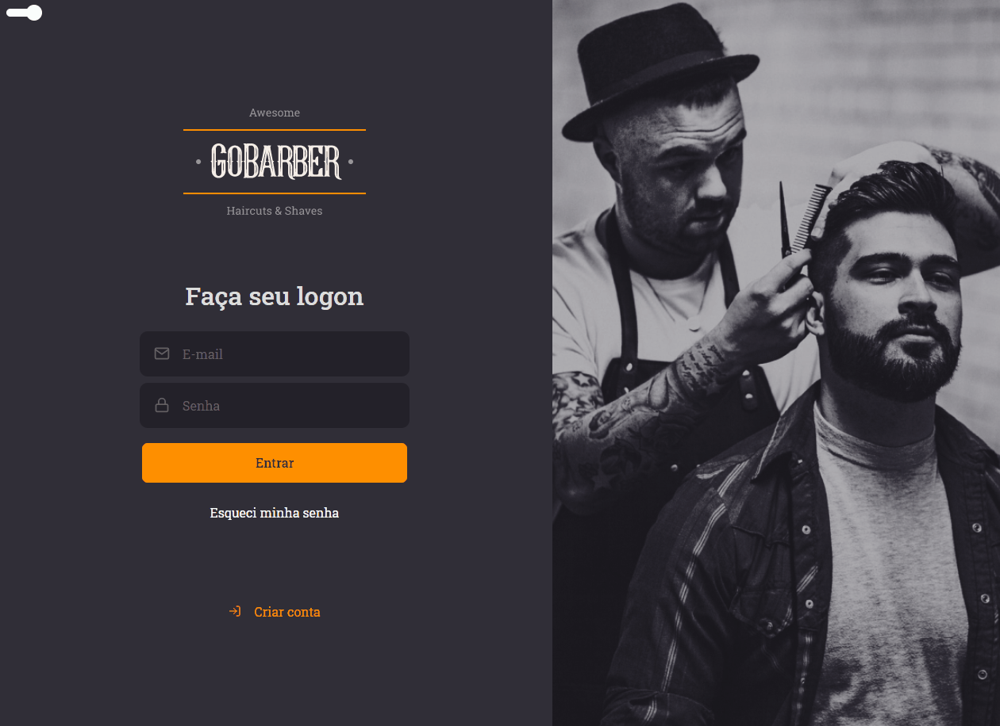
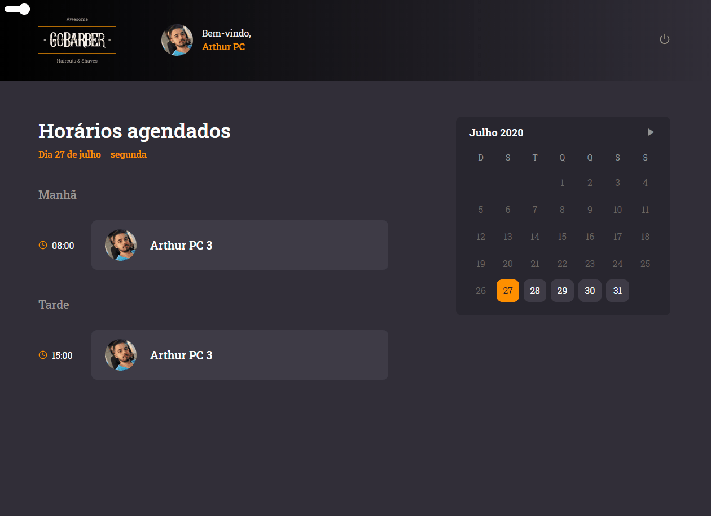

<h1 align="center">
   New GoBarber
</h1>

 

## :camera: Demonstração

  
  

## :rocket: Tecnologias

Esse projeto foi desenvolvido com as seguintes tecnologias:

✔️Typescript

✔️React

✔️React Hooks

✔️Context API

✔️Styled-components

✔️Unform

✔️React Spring

✔️Polished

✔️React-day-picker

✔️date-fns

✔️Docker

✔️PostgreSQL

✔️Node

✔️Axios

## 💻 Projeto

GoBarber é um aplicativo que permite aos usuários agendar uma consulta com seu barbeiro favorito e mostra ao barbeiro sua agenda para o dia.

## ⚙ Configuração

1- Para instalar as dependências:
> yarn

2- Para iniciar a aplicação:
> yarn start

---
